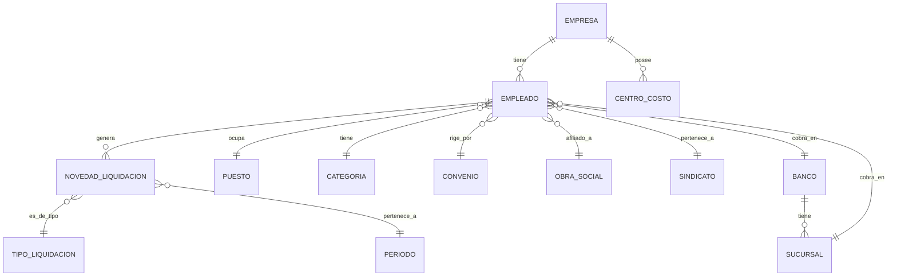

# 📋 PLAN DE TRABAJO - SISTEMA DE NOVEDADES DE LIQUIDACIÓN

## 🎯 RESUMEN EJECUTIVO

**Objetivo:** Desarrollar una interfaz frontend para la carga de novedades de liquidación utilizando los endpoints existentes del proyecto ApiIdeafix.

**Alcance:** Sistema completo de gestión de novedades con pantallas de listado, carga, edición y consulta.

**Fecha de Creación:** Agosto 2024  
**Estado:** En Planificación

---

## 📊 ANÁLISIS DEL PROYECTO APIIDEAFIX

### Endpoints Identificados (Relevantes para Liquidación):

#### 🏢 Entidades Organizacionales:
- `/combo/emps` - Empresas
- `/combo/ccosto/{empresa}` - Centros de costo por empresa
- `/combo/estr` - Estructuras organizacionales
- `/combo/ubi` - Ubicaciones

#### 👥 Gestión de Personal:
- `/combo/puestos` - Puestos de trabajo
- `/combo/cate` - Categorías laborales
- `/combo/convenios` - Convenios colectivos
- `/combo/tipcont` - Tipos de contrato
- `/combo/tpers` - Tipos de personal

#### 💰 Entidades Financieras:
- `/combo/bancos` - Bancos
- `/combo/suc/{banco}` - Sucursales bancarias por banco
- `/combo/tipliq` - Tipos de liquidación ⭐ (Crítico)

#### 🎯 Beneficios y Aportes:
- `/combo/osoc` - Obras sociales
- `/combo/sind` - Sindicatos
- `/combo/plan` - Planes de beneficios

#### 🌍 Datos Geográficos:
- `/combo/pais` - Países
- `/combo/provi/{pais}` - Provincias por país
- `/combo/locali/{pais}/{provincia}` - Localidades

#### 🎓 Información Educativa:
- `/combo/estud` - Niveles educativos
- `/combo/titu/{nivel}` - Títulos por nivel educativo
- `/combo/calif` - Calificaciones profesionales

---

## 🗺️ ENTIDADES RELACIONADAS CON NOVEDADES

### Estructura de Datos Inferida:



### Campos Principales por Entidad:

#### Novedad de Liquidación:
- ID de novedad
- ID del empleado
- Tipo de liquidación
- Período
- Concepto
- Importe
- Estado (Nuevo, Procesado, Aprobado, Liquidado)
- Fecha de creación
- Observaciones

#### Empleado:
- Legajo
- Nombre completo
- Empresa
- Puesto
- Categoría
- Convenio
- Obra social
- Sindicato
- Datos bancarios

---

## 🎨 DISEÑO DEL FLUJO DE USUARIO

### 📱 Pantallas Principales Identificadas:

1. **Dashboard Principal** - Vista general de novedades y métricas
2. **Listado de Novedades** - Grilla con filtros avanzados y búsqueda
3. **Formulario de Carga** - Creación de nuevas novedades
4. **Detalle/Edición** - Visualización y modificación de novedades
5. **Configuraciones** - Gestión de catálogos y parámetros del sistema

### 🔄 Flujo de Navegación:

```
Dashboard → Listado Novedades → [Nueva Novedad / Editar Novedad] → Detalle → Confirmación
     ↓                                    ↑
Configuraciones ←→ Catálogos de Datos ←→ Validaciones
```

### Estados de una Novedad:
1. **Nuevo** - Recién creada, pendiente de validación
2. **Procesado** - Validada y procesada por el sistema
3. **Aprobado** - Aprobada por supervisor/gerencia
4. **Liquidado** - Incluida en liquidación de sueldos
5. **Rechazado** - Rechazada con observaciones

---

## 🖼️ WIREFRAMES CONCEPTUALES

### 1. Dashboard Principal
```
┌─────────────────────────────────────────────────────────┐
│ 🏠 Dashboard - Novedades de Liquidación                │
├─────────────────────────────────────────────────────────┤
│ 📊 RESUMEN DEL MES ACTUAL                               │
│ ┌─────────┐ ┌─────────┐ ┌─────────┐ ┌─────────┐       │
│ │ Nuevas  │ │Procesad.│ │Aprobad. │ │Liquidad.│       │
│ │   45    │ │  12     │ │  33     │ │  156    │       │
│ └─────────┘ └─────────┘ └─────────┘ └─────────┘       │
│                                                         │
│ 🔍 ACCESOS RÁPIDOS                                     │
│ [+ Nueva Novedad] [📋 Ver Todas] [⚙️ Configuración]   │
│                                                         │
│ 📈 TENDENCIAS (Últimos 6 meses)                        │
│ ┌─────────────────────────────────────────────────────┐ │
│ │     ██                                              │ │
│ │   ████    ██                                        │ │
│ │ ██████  ████  ██    ██    ██    ██                  │ │
│ │ ENE FEB MAR ABR MAY JUN                            │ │
│ └─────────────────────────────────────────────────────┘ │
│                                                         │
│ ⚠️ ALERTAS Y NOTIFICACIONES                            │
│ • 3 novedades pendientes de aprobación                 │
│ • Plazo límite carga: 15 días restantes                │
└─────────────────────────────────────────────────────────┘
```

### 2. Listado de Novedades
```
┌─────────────────────────────────────────────────────────┐
│ 📋 Listado de Novedades - Liquidación                  │
├─────────────────────────────────────────────────────────┤
│ 🔍 FILTROS AVANZADOS                                    │
│ ┌─────────────┐┌─────────────┐┌─────────────┐┌────────┐ │
│ │Empresa    ▼││Período    ▼││Estado     ▼││Tipo  ▼│ │
│ │Todas       ││Mar 2024    ││Todos       ││Todos  │ │
│ └─────────────┘└─────────────┘└─────────────┘└────────┘ │
│ ┌─────────────────────────────────────┐ [🔍] [🔄 Reset] │
│ │ Buscar por empleado, concepto...    │                 │
│ └─────────────────────────────────────┘                 │
├─────────────────────────────────────────────────────────┤
│ [✓] SELECCIÓN MÚLTIPLE                                  │
│ ┌─┬────────┬─────────────┬────────────┬────────┬────────┬───┐
│ │✓│Empresa │Empleado     │Concepto    │Importe │Estado  │⚙️ │
│ ├─┼────────┼─────────────┼────────────┼────────┼────────┼───┤
│ │□│TechCorp│Juan Pérez   │Horas Extra │$15,250 │Nuevo   │📝 │
│ │□│DataSoft│María García │Presentismo │$5,000  │Aprobado│👁 │
│ │□│InfoSys │Luis Rodrígz │Viáticos    │$8,750  │Liquid. │📊 │
│ │□│TechCorp│Ana Martínez │Hs Nocturnas│$12,400 │Proceso │📝 │
│ │□│DataSoft│Carlos López │Asig Familiar│$3,200  │Nuevo   │📝 │
│ └─┴────────┴─────────────┴────────────┴────────┴────────┴───┘
│                                                         │
│ 📄 Mostrando 1-5 de 234 registros                      │
│ [◀ Anterior] Página 1 de 47 [Siguiente ▶]             │
│                                                         │
│ 🛠️ ACCIONES MASIVAS                                     │
│ [+ Nueva Novedad] [🗑️ Eliminar Selec.] [📤 Exportar]    │
│ [✅ Aprobar Selec.] [⏸️ Pausar Selec.]                   │
└─────────────────────────────────────────────────────────┘
```

### 3. Formulario de Carga de Novedad
```
┌─────────────────────────────────────────────────────────┐
│ ✨ Nueva Novedad de Liquidación                         │
├─────────────────────────────────────────────────────────┤
│ 📋 PASO 1: DATOS BÁSICOS                               │
│ ┌─────────────────────┐ ┌─────────────────────────────┐ │
│ │ Empresa*            │ │ Período de Liquidación*     │ │
│ │ [TechCorp S.A.   ▼] │ │ [📅 Marzo 2024           ▼] │ │
│ └─────────────────────┘ └─────────────────────────────┘ │
│                                                         │
│ 👤 PASO 2: SELECCIÓN DE EMPLEADO                       │
│ ┌─────────────────────────────────────────────────────┐ │
│ │ 🔍 Buscar: [Juan Pérez____________] [🔍 Buscar]     │ │
│ │                                                     │ │
│ │ ✅ Empleado Seleccionado:                           │ │
│ │ 📋 Juan Carlos Pérez - Legajo: 1234                │ │
│ │ 🏢 Puesto: Desarrollador Senior                     │ │
│ │ 📊 Categoría: A1 - Profesional                     │ │
│ │ 📋 Convenio: CCT Sistemas                           │ │
│ └─────────────────────────────────────────────────────┘ │
│                                                         │
│ 💰 PASO 3: DETALLE DE LA NOVEDAD                       │
│ ┌─────────────────┐ ┌─────────────────┐ ┌───────────┐ │
│ │ Tipo de Novedad*│ │ Concepto*       │ │ Cantidad  │ │
│ │ [Hs Extra    ▼] │ │ [50% c/recargo▼]│ │ [20____]  │ │
│ └─────────────────┘ └─────────────────┘ └───────────┘ │
│                                                         │
│ ┌───────────────┐ ┌─────────────────────────────────────┐ │
│ │ Importe*      │ │ Período de Aplicación              │ │
│ │ [$15,250.00]  │ │ [📅 01/03/24] a [📅 31/03/24]       │ │
│ └───────────────┘ └─────────────────────────────────────┘ │
│                                                         │
│ 📝 OBSERVACIONES                                        │
│ ┌─────────────────────────────────────────────────────┐ │
│ │ Horas extra trabajadas en proyecto urgente...      │ │
│ │                                                     │ │
│ └─────────────────────────────────────────────────────┘ │
│                                                         │
│ 📎 ARCHIVOS ADJUNTOS (Opcional)                        │
│ [📁 Subir archivo] [documento.pdf] [❌]                 │
│                                                         │
│ ⚠️ VALIDACIONES                                         │
│ ✅ Empleado activo en el período                        │
│ ✅ Concepto válido para la categoría                    │
│ ⚠️ Importe superior al promedio (Verificar)             │
│                                                         │
│ [💾 Guardar] [👁 Vista Previa] [📋 Guardar y Nuevo] [❌ Cancelar] │
└─────────────────────────────────────────────────────────┘
```

### 4. Vista Detalle/Edición
```
┌─────────────────────────────────────────────────────────┐
│ 👁 Detalle de Novedad #1234                             │
│ [📝 Editar] [🗑️ Eliminar] [📋 Duplicar] [⬅️ Volver]      │
├─────────────────────────────────────────────────────────┤
│ 📊 INFORMACIÓN GENERAL                                   │
│ Estado: [🟢 Aprobado]  |  Creado: 15/03/2024 14:30      │
│ Última modificación: 16/03/2024 09:15 por M.García      │
│                                                         │
│ 🏢 DATOS DE LA EMPRESA                                  │
│ Empresa: TechCorp S.A.                                  │
│ Centro de Costo: Desarrollo - DEV001                    │
│ Período: Marzo 2024                                     │
│                                                         │
│ 👤 DATOS DEL EMPLEADO                                   │
│ Nombre: Juan Carlos Pérez                               │
│ Legajo: 1234  |  CUIL: 20-12345678-9                   │
│ Puesto: Desarrollador Senior                            │
│ Categoría: A1 - Profesional                            │
│                                                         │
│ 💰 DETALLE DE LA NOVEDAD                                │
│ Tipo: Horas Extra                                       │
│ Concepto: 50% con recargo                               │
│ Cantidad: 20 horas                                      │
│ Importe: $15,250.00                                     │
│ Período aplicación: 01/03/2024 - 31/03/2024            │
│                                                         │
│ 📝 OBSERVACIONES                                        │
│ Horas extra trabajadas en proyecto urgente para        │
│ cliente Premium. Autorizado por Gerencia IT.           │
│                                                         │
│ 📎 ARCHIVOS ADJUNTOS                                    │
│ 📄 autorizacion_horas_extra.pdf (125 KB)               │
│                                                         │
│ 📜 HISTORIAL DE CAMBIOS                                │
│ 16/03/2024 09:15 - M.García: Aprobó la novedad         │
│ 15/03/2024 16:45 - J.Pérez: Agregó archivo adjunto     │
│ 15/03/2024 14:30 - J.Pérez: Creó la novedad            │
└─────────────────────────────────────────────────────────┘
```

### 5. Panel de Configuración
```
┌─────────────────────────────────────────────────────────┐
│ ⚙️ Configuración del Sistema                            │
├─────────────────────────────────────────────────────────┤
│ 📋 CATÁLOGOS DE DATOS                                   │
│ ┌─────────────────┐ ┌─────────────────┐ ┌─────────────┐ │
│ │ 💼 Empresas     │ │ 👥 Empleados    │ │ 💰 Conceptos │ │
│ │ [Gestionar]     │ │ [Gestionar]     │ │ [Gestionar]  │ │
│ └─────────────────┘ └─────────────────┘ └─────────────┘ │
│                                                         │
│ ┌─────────────────┐ ┌─────────────────┐ ┌─────────────┐ │
│ │ 🏛️ Bancos       │ │ 🎯 Categorías   │ │ 📋 Convenios │ │
│ │ [Gestionar]     │ │ [Gestionar]     │ │ [Gestionar]  │ │
│ └─────────────────┘ └─────────────────┘ └─────────────┘ │
│                                                         │
│ ⚙️ PARÁMETROS DEL SISTEMA                               │
│ ┌─────────────────────────────────────────────────────┐ │
│ │ ✅ Validar importes contra promedios históricos     │ │
│ │ ✅ Requerir aprobación para importes > $50,000      │ │
│ │ ✅ Notificar por email cambios de estado            │ │
│ │ ✅ Backup automático diario                         │ │
│ │ ⏰ Límite de carga: 15 días antes del cierre        │ │
│ │ 📧 Email notificaciones: admin@empresa.com          │ │
│ └─────────────────────────────────────────────────────┘ │
│                                                         │
│ 👥 GESTIÓN DE USUARIOS                                  │
│ ┌─────────────────────────────────────────────────────┐ │
│ │ • Administrador: Acceso total                       │ │
│ │ • Supervisor: Aprobación de novedades               │ │
│ │ • Operador: Carga y consulta                        │ │
│ │                                           [Gestionar]│ │
│ └─────────────────────────────────────────────────────┘ │
│                                                         │
│ [💾 Guardar Configuración] [🔄 Restaurar Defaults]     │
└─────────────────────────────────────────────────────────┘
```

---

## 🏗️ ARQUITECTURA FRONTEND PROPUESTA

### Tecnologías Recomendadas:
- **Framework:** React 18+ con TypeScript
- **Estado Global:** Context API + useReducer / Zustand
- **UI Framework:** Material-UI v5 / Ant Design / Mantine
- **Formularios:** React Hook Form + Zod/Yup para validaciones
- **Tablas de Datos:** React Table v8 / Ant Design Table
- **HTTP Client:** Axios con interceptores
- **Routing:** React Router v6
- **Fechas:** Day.js
- **Iconos:** React Icons / Lucide React
- **Build Tool:** Vite
- **Testing:** Vitest + React Testing Library

### Estructura de Directorios:
```
src/
├── components/
│   ├── common/
│   │   ├── Header.tsx
│   │   ├── Sidebar.tsx
│   │   ├── LoadingSpinner.tsx
│   │   ├── ErrorBoundary.tsx
│   │   ├── ConfirmDialog.tsx
│   │   └── NotificationToast.tsx
│   ├── forms/
│   │   ├── NovedadForm.tsx
│   │   ├── EmpleadoSelector.tsx
│   │   ├── ConceptoSelector.tsx
│   │   ├── FormFields/
│   │   │   ├── SelectField.tsx
│   │   │   ├── DateField.tsx
│   │   │   ├── NumberField.tsx
│   │   │   └── TextAreaField.tsx
│   │   └── validators/
│   │       ├── novedadValidators.ts
│   │       └── commonValidators.ts
│   ├── tables/
│   │   ├── NovedadesTable.tsx
│   │   ├── TableFilters.tsx
│   │   ├── TablePagination.tsx
│   │   └── ExportButton.tsx
│   ├── dashboard/
│   │   ├── MetricsCards.tsx
│   │   ├── TrendsChart.tsx
│   │   ├── RecentActivity.tsx
│   │   └── AlertsPanel.tsx
│   └── layout/
│       ├── MainLayout.tsx
│       ├── AuthLayout.tsx
│       └── ErrorLayout.tsx
├── pages/
│   ├── Dashboard.tsx
│   ├── NovedadesList.tsx
│   ├── NovedadForm.tsx
│   ├── NovedadDetail.tsx
│   ├── Configuration.tsx
│   ├── Login.tsx
│   └── NotFound.tsx
├── services/
│   ├── api/
│   │   ├── apiClient.ts
│   │   ├── interceptors.ts
│   │   └── endpoints.ts
│   ├── novedades.service.ts
│   ├── combos.service.ts
│   ├── auth.service.ts
│   └── export.service.ts
├── hooks/
│   ├── useNovedades.ts
│   ├── useCombos.ts
│   ├── useAuth.ts
│   ├── useFilters.ts
│   └── useExport.ts
├── context/
│   ├── AuthContext.tsx
│   ├── NovedadesContext.tsx
│   └── ConfigContext.tsx
├── types/
│   ├── api.types.ts
│   ├── novedad.types.ts
│   ├── empleado.types.ts
│   ├── combo.types.ts
│   └── auth.types.ts
├── utils/
│   ├── formatters.ts
│   ├── validators.ts
│   ├── constants.ts
│   ├── dateHelpers.ts
│   └── exportHelpers.ts
├── styles/
│   ├── globals.css
│   ├── theme.ts
│   └── components/
└── __tests__/
    ├── components/
    ├── services/
    ├── utils/
    └── setup.ts
```

### Patrones de Diseño a Implementar:

1. **Repository Pattern** - Para abstracción de la capa de datos
2. **Observer Pattern** - Para notificaciones y actualizaciones en tiempo real
3. **Factory Pattern** - Para creación de validadores y formatters
4. **Strategy Pattern** - Para diferentes tipos de exportación
5. **Composition Pattern** - Para construcción de componentes complejos

---

## 📝 ESPECIFICACIONES FUNCIONALES DETALLADAS

### 1. ✨ Gestión de Novedades

#### Crear Nueva Novedad:
- **Validaciones en tiempo real:**
  - Empleado activo en el período seleccionado
  - Concepto válido para la categoría del empleado
  - Importe dentro de rangos permitidos
  - Fechas válidas y coherentes
- **Campos obligatorios:**
  - Empresa, Empleado, Tipo de novedad, Concepto, Importe
- **Campos opcionales:**
  - Cantidad, Período específico, Observaciones, Archivos adjuntos
- **Funcionalidades adicionales:**
  - Autocompletado de datos del empleado
  - Cálculo automático de importes basado en parámetros
  - Vista previa antes de guardar
  - Duplicar novedad existente

#### Editar Novedad:
- **Restricciones por estado:**
  - Nuevo/Procesado: Edición completa
  - Aprobado: Solo observaciones
  - Liquidado: Solo lectura
- **Historial de cambios:** Registro de todas las modificaciones
- **Validaciones:** Mismas que en creación + validación de integridad

#### Eliminar Novedad:
- **Confirmación:** Diálogo de confirmación con detalle
- **Restricciones:** No se puede eliminar si está liquidada
- **Logging:** Registro de eliminaciones para auditoría

### 2. 🔍 Búsqueda y Filtrado Avanzado

#### Filtros Disponibles:
- **Por Empresa:** Dropdown con todas las empresas activas
- **Por Período:** Selector de mes/año con navegación rápida
- **Por Estado:** Multiselección (Nuevo, Procesado, Aprobado, Liquidado)
- **Por Tipo de Novedad:** Todas las opciones disponibles
- **Por Empleado:** Búsqueda por nombre, legajo o CUIL
- **Por Rango de Importes:** Min y max con validación
- **Por Fecha de Creación:** Rango de fechas

#### Funcionalidades de Búsqueda:
- **Búsqueda en tiempo real:** Filtrado automático mientras se escribe
- **Búsqueda inteligente:** Tolerancia a errores tipográficos
- **Filtros combinados:** Múltiples filtros aplicados simultáneamente
- **Guardado de filtros:** Guardar configuraciones de filtros favoritas
- **Limpieza rápida:** Botón para resetear todos los filtros

### 3. 📊 Visualización y Reportes

#### Dashboard Principal:
- **Métricas clave:**
  - Total de novedades por estado
  - Importe total del período
  - Comparativa con período anterior
  - Alertas y notificaciones
- **Gráficos:**
  - Tendencia de novedades por mes
  - Distribución por tipo de novedad
  - Top empleados con más novedades
  - Distribución por empresa

#### Listado de Novedades:
- **Tabla responsiva:** Adaptable a diferentes tamaños de pantalla
- **Columnas configurables:** Mostrar/ocultar columnas según preferencias
- **Ordenamiento:** Por cualquier columna, ascendente/descendente
- **Paginación:** Configurable (10, 25, 50, 100 registros por página)
- **Acciones por fila:** Editar, ver detalle, eliminar, duplicar

#### Exportación de Datos:
- **Formatos disponibles:** Excel, PDF, CSV
- **Alcance:** Registros filtrados o todos
- **Configuración:** Selección de columnas a exportar
- **Programación:** Reportes automáticos por email

### 4. ⚙️ Configuración del Sistema

#### Gestión de Catálogos:
- **Mantenimiento de datos maestros:**
  - Empresas, Empleados, Conceptos, Categorías
  - Bancos, Sucursales, Obras Sociales, Sindicatos
- **Operaciones CRUD completas**
- **Validaciones de integridad referencial**
- **Importación masiva desde Excel**

#### Parámetros del Sistema:
- **Límites y restricciones:**
  - Importe máximo por novedad
  - Cantidad máxima de novedades por empleado/período
  - Días límite para carga
- **Notificaciones:**
  - Configuración de emails
  - Alertas por importes elevados
  - Notificaciones de cambio de estado
- **Auditoría:**
  - Registro de todas las operaciones
  - Backup automático
  - Retención de historiales

#### Gestión de Usuarios:
- **Roles y permisos:**
  - Administrador: Acceso total
  - Supervisor: Aprobación y consulta
  - Operador: Carga y consulta limitada
  - Consulta: Solo lectura
- **Autenticación:** Integración con sistemas corporativos
- **Sesiones:** Control de sesiones activas y timeout

---

## 🚀 ROADMAP DE DESARROLLO

### 📅 Cronograma Detallado:

#### **Fase 1: Fundación y Setup (Semanas 1-2)**
- **Semana 1:**
  - [ ] Setup del proyecto React con TypeScript
  - [ ] Configuración de herramientas (ESLint, Prettier, Husky)
  - [ ] Setup de Vite como build tool
  - [ ] Configuración de testing con Vitest
  - [ ] Integración con ApiIdeafix
- **Semana 2:**
  - [ ] Implementación de layout base (Header, Sidebar)
  - [ ] Sistema de routing con React Router
  - [ ] Configuración de tema y estilos globales
  - [ ] Componentes comunes (Loading, Error, Notifications)
  - [ ] Servicios base para API calls

#### **Fase 2: Core Features (Semanas 3-4)**
- **Semana 3:**
  - [ ] Implementación del listado de novedades
  - [ ] Sistema de filtros básicos
  - [ ] Paginación y ordenamiento
  - [ ] Servicio de novedades con CRUD básico
- **Semana 4:**
  - [ ] Formulario de carga de novedades
  - [ ] Validaciones en tiempo real
  - [ ] Selector de empleados con búsqueda
  - [ ] Integración con endpoints de combos

#### **Fase 3: Funcionalidades Avanzadas (Semanas 5-6)**
- **Semana 5:**
  - [ ] Dashboard con métricas y gráficos
  - [ ] Filtros avanzados y búsqueda inteligente
  - [ ] Vista detalle de novedades
  - [ ] Sistema de estados y workflows
- **Semana 6:**
  - [ ] Exportación de datos (Excel, PDF, CSV)
  - [ ] Subida de archivos adjuntos
  - [ ] Sistema de notificaciones
  - [ ] Historial de cambios

#### **Fase 4: Optimización y Testing (Semanas 7-8)**
- **Semana 7:**
  - [ ] Optimizaciones de performance
  - [ ] Testing unitario y de integración
  - [ ] Validación de accesibilidad
  - [ ] Responsive design refinement
- **Semana 8:**
  - [ ] Testing end-to-end
  - [ ] Documentación técnica
  - [ ] Manual de usuario
  - [ ] Preparación para deployment

#### **Fase 5: Deployment y Post-Launch (Semana 9)**
- [ ] Configuración de CI/CD
- [ ] Deployment a producción
- [ ] Monitoreo y logging
- [ ] Capacitación de usuarios
- [ ] Soporte post-lanzamiento

---

## 🎯 CRITERIOS DE ACEPTACIÓN

### Funcionales:
- [ ] Usuario puede crear, editar y eliminar novedades
- [ ] Sistema valida datos en tiempo real
- [ ] Filtros y búsquedas funcionan correctamente
- [ ] Exportación genera archivos válidos
- [ ] Dashboard muestra métricas actualizadas
- [ ] Workflow de aprobación funciona según roles

### No Funcionales:
- [ ] Tiempo de carga inicial < 3 segundos
- [ ] Respuesta de operaciones CRUD < 1 segundo
- [ ] Compatible con Chrome, Firefox, Safari, Edge
- [ ] Responsive en dispositivos móviles y tablets
- [ ] Accesible según estándares WCAG 2.1 AA
- [ ] Disponibilidad 99.5% en horario laboral

### Seguridad:
- [ ] Validación de datos en frontend y backend
- [ ] Control de acceso por roles
- [ ] Logging de operaciones críticas
- [ ] Protección contra ataques XSS y CSRF
- [ ] Encriptación de datos sensibles

---

## 📋 DOCUMENTACIÓN REQUERIDA

### Técnica:
- [ ] Guía de instalación y configuración
- [ ] Documentación de APIs
- [ ] Diagramas de arquitectura
- [ ] Manual de deployment
- [ ] Guía de troubleshooting

### Usuario:
- [ ] Manual de usuario final
- [ ] Guías de workflows principales
- [ ] Videos tutoriales
- [ ] FAQ y casos de uso
- [ ] Guía de administración

---

## 🔧 HERRAMIENTAS Y RECURSOS

### Desarrollo:
- **IDE:** VS Code con extensiones React/TypeScript
- **Control de versiones:** Git con GitFlow
- **Package Manager:** npm/yarn
- **CI/CD:** GitHub Actions / Jenkins
- **Monitoring:** Sentry para error tracking

### Testing:
- **Unit Testing:** Vitest + React Testing Library
- **E2E Testing:** Playwright / Cypress
- **Performance:** Lighthouse CI
- **Security:** OWASP ZAP

### Diseño:
- **Prototipado:** Figma
- **Iconos:** React Icons / Lucide
- **UI Kit:** Material-UI / Ant Design
- **Documentación:** Storybook

---

## 🎯 MÉTRICAS DE ÉXITO

### KPIs Técnicos:
- **Performance:** Tiempo de carga < 3s
- **Disponibilidad:** Uptime > 99.5%
- **Errores:** Tasa de errores < 0.1%
- **Coverage:** Cobertura de tests > 80%

### KPIs de Negocio:
- **Adopción:** % de usuarios activos mensualmente
- **Eficiencia:** Reducción de tiempo de carga de novedades
- **Precisión:** Reducción de errores en liquidaciones
- **Satisfacción:** Score de satisfacción de usuarios > 4/5

---

## 🔄 MANTENIMIENTO Y EVOLUCIÓN

### Actualizaciones Planificadas:
- **Mensuales:** Actualizaciones de seguridad y bugfixes
- **Trimestrales:** Nuevas funcionalidades menores
- **Anuales:** Actualizaciones mayores de tecnología

### Roadmap Futuro:
- [ ] Integración con sistemas de RRHH
- [ ] API mobile para acceso desde dispositivos
- [ ] Inteligencia artificial para detección de anomalías
- [ ] Dashboard ejecutivo con BI avanzado
- [ ] Integración con sistemas de nómina externos

---

**Documento creado el:** Agosto 2024  
**Versión:** 1.0  
**Estado:** En Planificación  
**Próxima revisión:** Al finalizar Fase 1

---

> 💡 **Nota:** Este documento es un plan vivo que se actualizará conforme avance el proyecto y se obtenga feedback de stakeholders y usuarios.